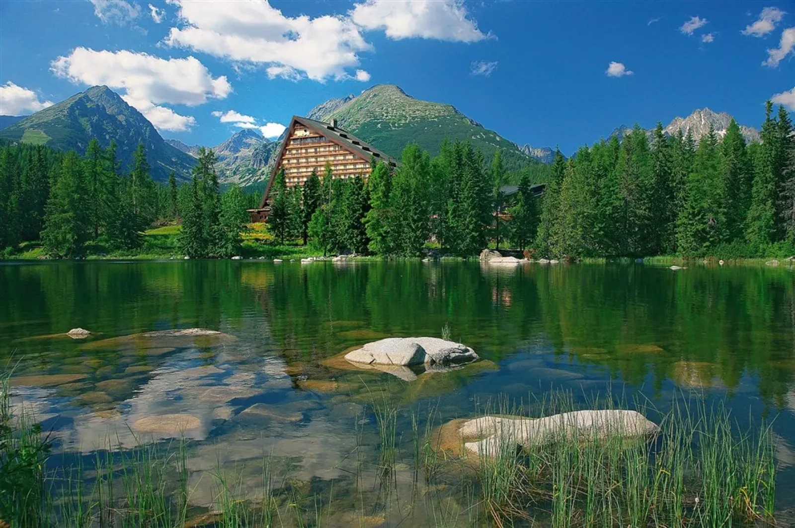

# 🌳 Mobile First Nature Website
**(Responsive Website · Mobile First · CSS Grid · Responsive Images)**

A responsive nature-themed website built with a Mobile First approach. This educational portfolio project was created to practice responsive layouts, CSS Grid, responsive images, and semantic HTML.

[🔗 **Live Preview**](https://karchmarek.github.io/Mobile-first-nature-website/)

---

## 🚀 Tech Stack

- **HTML5** – Semantic page structure and responsive image markup.
- **CSS3** – Mobile First styling, CSS Grid, responsive layouts, typography, and media queries.
- **Normalize.css** – Consistent default styling across browsers.
- **Font Awesome** – Icons used throughout the interface.
- **Google Fonts** – Source Sans 3 typography.

---

## 💡 What I Practiced

- **Mobile First Development** – Built the initial layout for mobile screens and progressively enhanced it for tablet and desktop sizes.
- **Responsive Design** – Used media queries to adapt navigation, cards, typography, spacing, and layout across different screen sizes.
- **CSS Grid** – Used Grid to transform destination cards from a mobile horizontal layout into a three-column desktop layout.
- **Responsive Images** – Used the `<picture>` element with different image sources for mobile, tablet, and desktop screens.
- **Image Optimization** – Prepared WebP images in multiple sizes to serve more appropriate image dimensions for different devices.
- **Semantic HTML** – Structured the page using semantic elements such as `header`, `nav`, `main`, `section`, `article`, and `footer`.
- **Responsive Navigation** – Created a mobile navigation state with a menu icon and a full navigation layout for larger screens.
- **Forms** – Created a responsive newsletter subscription form.
- **CSS Components** – Built reusable cards, buttons, content sections, and responsive layouts using CSS.

---

## 🎯 Project Goal

The goal of this project was to design and build a responsive nature-themed website using a Mobile First approach.

The project focuses on:

- Starting the layout from the smallest screen size.
- Progressively adapting the design for tablet and desktop screens.
- Creating responsive destination cards.
- Serving different image sizes depending on the viewport width.
- Practicing CSS Grid and responsive layouts.
- Building a complete webpage using semantic HTML and CSS without JavaScript.

---

## 🖼️ Responsive Images

The project uses the `<picture>` element to serve different WebP images depending on the viewport width.

Each visual section has multiple image sizes:

- **Small** – mobile devices
- **Medium** – tablet devices
- **Large** – desktop devices

For example:

```html
<picture>
    <source media="(max-width: 560px)" srcset="img/hero-small.webp">
    <source media="(max-width: 1024px)" srcset="img/hero-medium.webp">
    
</picture>
```
---

## 📱 Responsive Breakpoints

The layout uses three main stages:

- Mobile: up to 560px
- Tablet: 561px – 1023px
- Desktop: 1024px and above

The layout progressively changes from a compact mobile card layout to a three-column desktop grid.

---

## 🛠️ How to Run Locally
1. Clone the repository:

```bash
git clone https://github.com/KarchMarek/mobile-first-nature-website.git
```

2. Open `index.html` in your browser.
